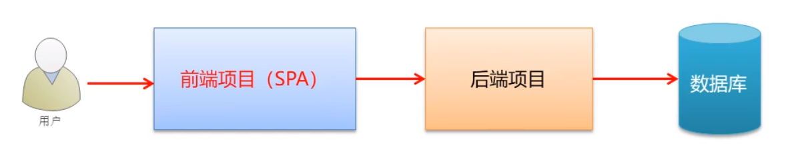

# vue_shop

## Project setup
```
npm install
```

### Compiles and hot-reloads for development
```
npm run serve
```

### Compiles and minifies for production
```
npm run build
```

## Target

该项目为电商后台管理系统，要求：

* 能够基于Vue初始化项目
* 能够基于Vue技术栈进行项目开发
* 能够使用Vue的第三方组件进行项目开发
* 能够说出前后端分离的开发模式

## Overview

### 功能

* 用户登录
* 退出登录
* 用户管理
* 权限管理
  * 角色列表
  * 权限列表
* 商品管理
  * 商品列表
  * 分类管理
  * 参数管理
* 订单管理
* 数据统计

### 开发模式

电商后台管理系统整体采用前后端分离的开发模式，其中前端项目是基于Vue技术栈的SPA项目。

### 技术选型

#### 前端项目技术栈

* Vue
* Vue-router
* Element-UI
* Axios
* Echarts

#### 后端项目技术栈

* Node.js
* Express
* Jwt  (状态保持工具,模仿session登录记录功能)
* Mysql
* Sequelize  (操作数据库的框架)